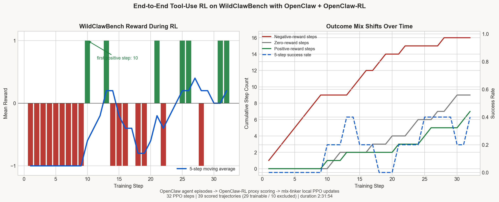
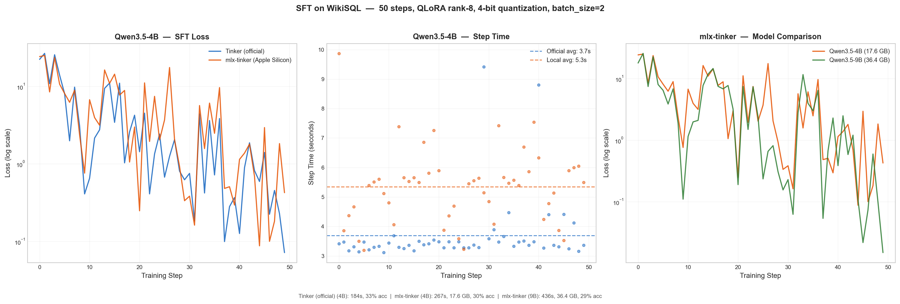

# mlx-tinker

**Local Tinker backend for Apple Silicon that can actually keep learning.** Run Qwen3.5 locally on a MacBook, plug it into OpenClaw, and do continual RL updates from real agent trajectories without sending your model traffic to the cloud.

mlx-tinker implements the [Tinker API](https://docs.tinker.ai) on top of Apple's [MLX](https://github.com/ml-explore/mlx) framework. The interesting part is that this is not just local inference: it now runs the full OpenClaw + OpenClaw-RL loop locally, with WildClawBench trajectories feeding reward into PPO updates on Apple Silicon.

## Local Continual RL on a MacBook

This is the part that matters most: **local agent RL is real**. In the validated setup below, WildClawBench task containers run OpenClaw, OpenClaw-RL scores the resulting trajectories, and `mlx-tinker` applies PPO updates locally on a MacBook.

- The run below is an end-to-end local OpenClaw loop, not a toy exact-match script.
- In the plotted run, the system completed 32 PPO steps and scored 39 trajectories locally.
- Reward moves off the floor and positive-reward steps start appearing in the back half of training.
- The same stack also supports live continual learning from OpenClaw sessions: once a session has a follow-up user turn, the proxy can score the prior turn and feed it into PPO.
- This stack was validated on an M4 MacBook Pro with 24GB unified memory.



The currently validated OpenClaw-RL dependency is the fork branch `ojus1/OpenClaw-RL@codex/qwen35-openclaw-tinker`. `mlx-tinker` bootstraps that automatically, so you do not need to wait for upstream PR timing to use the local-learning stack.

Multi-turn agent use is practical because `mlx-tinker` is not recomputing every long prompt from scratch on every turn. It uses **disk-backed transcript prefix caching** to offload reusable prompt/KV state locally, so repeated system prompts, tool schemas, and conversation prefixes can be restored instead of rebuilt. That is paired with **quantized KV cache** support for in-memory generation and **gradient checkpointing** for training-time memory savings, which is what makes longer OpenClaw sessions and local continual RL workable on a MacBook instead of collapsing under context growth.

## One Command to Get a Local Learning Agent

### Requirements

- macOS with Apple Silicon
- Python 3.12+
- `uv`
- `git`
- `node`
- Docker Desktop

Recommended models:

- `Qwen/Qwen3.5-4B` on 24GB+ Macs
- `Qwen/Qwen3.5-0.8B` on smaller-memory Macs

Install the repo:

```bash
git clone https://github.com/ojus1/mlx-tinker.git
cd mlx-tinker
uv sync
```

Then start the managed local-learning stack:

```bash
uv run python -m mlx_tinker openclaw setup --model Qwen/Qwen3.5-4B
```

The first run downloads the model, clones the required external repos into `.external/` (`OpenClaw` and the supported `OpenClaw-RL` fork), and builds the local OpenClaw gateway image, so expect it to take a few minutes.

That one command starts three pieces:

- native `mlx-tinker` inference + training backend
- native OpenClaw-RL proxy/trainer
- Dockerized OpenClaw gateway

It also patches OpenClaw to use the stable local model alias `mlx-tinker-local/local-primary`, installs the RL header plugin, and stores managed runtime state under `~/.openclaw/mlx-tinker/`.

### New OpenClaw Users

If you are starting fresh, the simplest path is:

```bash
uv run python -m mlx_tinker openclaw setup --model Qwen/Qwen3.5-4B
uv run python -m mlx_tinker openclaw status
```

After setup:

- OpenClaw is available on the local gateway port shown by `status`
- the default model already points at the local learning backend
- local webchat/CLI sessions stay inline instead of trying to route through outbound messaging tools

At that point you can use OpenClaw normally and the local RL stack is already live in the background.

### Existing OpenClaw Users

If you already use OpenClaw, run the same command:

```bash
uv run python -m mlx_tinker openclaw setup --model Qwen/Qwen3.5-4B
```

The managed setup is designed to preserve your existing OpenClaw installation:

- it backs up the current `~/.openclaw/openclaw.json`
- it keeps your channels, other agent settings, and workspace defaults intact
- it only switches the model/backend path over to the managed local-learning stack

So the practical migration is: keep your OpenClaw setup, swap in a local Tinker backend with continual RL, keep going.

### Service Commands

Useful follow-up commands:

```bash
uv run python -m mlx_tinker openclaw status
uv run python -m mlx_tinker openclaw logs --service all
uv run python -m mlx_tinker openclaw start
uv run python -m mlx_tinker openclaw stop
```

## How to Tell Learning Is Actually Happening

Serving and training are separate things, so the right thing to check is the proxy/trainer log:

```bash
uv run python -m mlx_tinker openclaw logs --service proxy
```

In a live OpenClaw session, look for lines like:

- `submitted session=...`
- `drained 1 groups`
- `forward_backward`
- `optim_step`

Training records are written under:

- `~/.openclaw/mlx-tinker/records/conversations.jsonl`
- `~/.openclaw/mlx-tinker/records/prm_scores.jsonl`

One important nuance: the current RL path scores a turn against the **next state**, so a single isolated one-turn chat will not train immediately. In practice, once the same session gets a follow-up user turn, the previous turn can be scored and submitted into PPO.

The loop is also **mostly asynchronous**. Inference stays live during batch collection, PRM scoring, `forward_backward`, and `optim_step`. The one deliberate pause is the weight swap: after an optimizer step, the proxy briefly pauses new submissions while it installs the updated sampling client, then resumes normal traffic.

## Important Configs for Real Multi-Turn Use

If you want the local agent loop to feel good on longer sessions, these are the knobs that matter most:

- `--max-context-tokens` on the OpenClaw-RL side controls how much context each training datum keeps before truncation. The managed OpenClaw flow currently uses `8192`, which is a reasonable default for realistic multi-turn agent prompts.
- `--prefix-cache-disk-limit-gb` on `mlx-tinker` controls how much disk space is available for transcript prefix caching. Default is `2.0` GB. Increase it if you expect long repeated system prompts, large tool schemas, or many active multi-turn sessions.
- `--kv-cache-bits` and `--kv-cache-group-size` control KV-cache quantization for inference. The default backend path uses 4-bit KV cache with group size `64` to keep memory pressure manageable on Apple Silicon.
- `--quantized-kv-start` controls when KV-cache quantization begins. Default is `0`, which means quantization starts immediately.
- `--checkpoints` controls where LoRA checkpoints and prefix-cache artifacts are stored. This is the directory to watch if you care about persistence, disk usage, or moving runs between machines.
- `--max-batch-size` and `--cycle-ms` are the backend scheduling knobs. They control how aggressively `mlx-tinker` batches requests and how often the engine cycles.

Managed OpenClaw defaults today:

- RL batch size: `1`
- RL max context tokens: `8192`
- Gateway bind: `lan`
- Prefix-cache disk budget on the `mlx-tinker` backend: `2.0` GB unless you override the plain backend flags

## Use mlx-tinker as a Plain Tinker Backend

If you do not want the OpenClaw stack and only want a local Tinker-compatible server, that path still works too:

```bash
uv run python -m mlx_tinker --model Qwen/Qwen3.5-0.8B
```

Then point the normal Tinker SDK at `localhost`:

```bash
python -c "
import tinker
client = tinker.ServiceClient(base_url='http://localhost:8080', api_key='local')
print(client.healthz())
"
```

## Tinker Compatibility is Real

The only change is `base_url`. Everything else — training loops, RL pipelines, checkpointing, sampling — is identical:

```python
import tinker

# Tinker (official):  client = tinker.ServiceClient()
# mlx-tinker:
client = tinker.ServiceClient(base_url="http://localhost:8080", api_key="local")

# Create a QLoRA training client
training = await client.create_lora_training_client_async(
    base_model="Qwen/Qwen3.5-4B", rank=8
)

# SFT training loop
for batch in train_data:
    await training.forward_backward_async(batch, loss_fn="cross_entropy")
    await training.optim_step_async(tinker.AdamParams(learning_rate=1e-4))

# Get a sampling client from the trained model
sampler = await training.save_weights_and_get_sampling_client_async()
response = await sampler.sample_async(
    prompt=tinker.ModelInput.from_ints(prompt_tokens),
    num_samples=1,
    sampling_params=tinker.SamplingParams(temperature=0.0, max_tokens=128),
)
print(tokenizer.decode(response.sequences[0].tokens))
```

**RL works too** — importance sampling, PPO, the full loop:

```python
# RL: sample rollouts, compute rewards, train with advantages
sampler = await training.save_weights_and_get_sampling_client_async()
rollouts = await sampler.sample_async(prompt, num_samples=8,
    sampling_params=tinker.SamplingParams(temperature=0.8, max_tokens=128))

rewards = [compute_reward(seq) for seq in rollouts.sequences]
advantages = [r - sum(rewards) / len(rewards) for r in rewards]

rl_batch = [build_rl_datum(seq, advantage) for seq, advantage in zip(rollouts.sequences, advantages)]
await training.forward_backward_async(rl_batch, loss_fn="importance_sampling")
await training.optim_step_async(tinker.AdamParams(learning_rate=5e-5))
```

## Benchmark: Tinker (official) vs mlx-tinker

50-step SFT on WikiSQL with QLoRA (rank-8, 4-bit quantization, batch_size=2):



| Metric | Tinker (official) 4B | mlx-tinker 4B (M4 MBP 24GB) | mlx-tinker 9B (M4 MBP 24GB) |
|--------|:----------------------:|:-----------------------------:|:-----------------------------:|
| Initial loss | 22.34 | 24.23 | 17.90 |
| Final loss | 0.07 | 0.43 | 0.01 |
| Avg step time | 3.7s | 5.3s | 8.7s |
| Total train time | 184s | 267s | 436s |
| Post-train eval accuracy | 33% | 30% | 29% |

Both backends converge on WikiSQL SFT with comparable accuracy. mlx-tinker trades some per-step speed for running entirely on your Mac — no cloud costs, no network latency, your data stays local. And Tinker (official) doesn't even support 9B — mlx-tinker lets you train larger models that the cloud can't.

## Features

### QLoRA with Gradient Checkpointing

4-bit quantized base model with LoRA adapters. Gradient checkpointing recomputes activations during the backward pass, dramatically reducing memory usage. All testing and development was done on a M4 MacBook Pro 24GB.

### Five Loss Functions

| Loss | Use Case | Formula |
|------|----------|---------|
| `cross_entropy` | SFT | `(-logp * w).sum()` |
| `importance_sampling` | Off-policy RL | `-(ratio * adv).sum()` |
| `ppo` | PPO-clip | `-min(ratio*adv, clip(ratio)*adv).sum()` |
| `cispo` | Conservative IS | `-(sg(clip(ratio)) * logp * adv).sum()` |
| `dro` | Direct Reward Opt | `-(logp*adv - 0.5*beta*(logp-old_lp)^2).sum()` |

All losses use **sum reduction** to match Tinker's official formulas.

### Supported Models

Non-MoE Qwen3.5 family:

| Model | Status |
|-------|:------:|
| Qwen/Qwen3.5-0.8B | Tested |
| Qwen/Qwen3.5-2B | Tested |
| Qwen/Qwen3.5-4B | Tested |
| Qwen/Qwen3.5-9B | Tested |
| Tesslate/OmniCoder-9B | Tested |

### OpenAI-Compatible Inference

```bash
curl http://localhost:8080/v1/chat/completions \
  -H "Content-Type: application/json" \
  -d '{"model": "default", "messages": [{"role": "user", "content": "Hello!"}]}'
```

## Architecture

```
tinker.ServiceClient
        |
   FastAPI Server (api/)         19 endpoints, full Tinker wire protocol
        |
   Async Engine (engine/)        100ms polling cycles, barrier-aware batching
        |
   MLX Backend (backend/)        QLoRA, training, inference, checkpointing
        |
   Apple Silicon (Metal GPU)     Unified memory, no CUDA
```

- **API layer** — FastAPI with Tinker-compatible request/response models, session management, and OpenAI-compat endpoints
- **Engine** — Async polling loop that batches compatible requests (forward_backward, sample) and respects barriers (optim_step must wait for all pending forward_backward)
- **Backend** — MLX compute: `nn.value_and_grad` for training, KV-cache inference, chunked cross-entropy, 8-bit Adam optimizer

## Run the Tests

```bash
# Unit tests (fast, no model download needed for most)
uv run pytest tests/ -k "not stress and not cookbook"

# SFT + RL cookbook tests (downloads Qwen3.5-0.8B, ~5 min)
uv run pytest tests/cookbook/ -m cookbook -v

# Full benchmark
uv run python scripts/run_benchmark.py --mlx-only --sft-steps 50
```

All 10 cookbook tests pass, covering SFT convergence, RL with importance sampling, PPO, tool-use RL, and capability proofs (SFT + RL progression on exact-match tasks).

## Requirements

- macOS with Apple Silicon (M1/M2/M3/M4)
- Python 3.12+
- Developed and tested on a M4 MacBook Pro 24GB

## Project Structure

```
mlx_tinker/
  api/        FastAPI server + Tinker endpoints + OpenAI compat
  engine/     Async request scheduler + dispatcher
  backend/    MLX training, inference, QLoRA, loss functions, checkpointing
  db/         SQLModel ORM with async SQLite (WAL mode)
  types.py    Tinker-compatible enums and data types
  config.py   Pydantic configuration
tests/
  cookbook/    SFT + RL end-to-end workflow tests
  stress/     Cross-framework parity tests (MLX vs PyTorch)
scripts/
  bootstrap_openclaw_rl.sh    Optional advanced helper for standalone wrapper scripts
  run_benchmark.py            Optional benchmark runner
  generate_readme_plot.py     Optional README asset generator
  generate_wcb_readme_plot.py Optional WildClawBench plot generator
```
