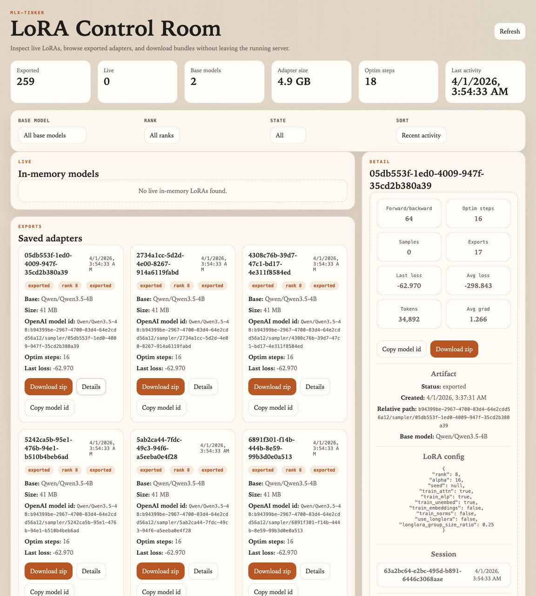

# mlx-tinker

**Proof-of-concept local Tinker backend for Apple Silicon that can actually keep learning.** Run Qwen3.5 locally on a MacBook, plug it into an agent runtime, and do continual RL updates from real agent trajectories.

`mlx-tinker` implements the [Tinker API](https://docs.tinker.ai) on top of Apple's [MLX](https://github.com/ml-explore/mlx) framework. The interesting part is not just local inference: this repo now has working local continual-learning loops for both **OpenClaw** and **Hermes Agent**, with reward flowing back into local PPO-style updates on Apple Silicon.

## Local Continual RL on a MacBook

In the validated OpenClaw setup below, WildClawBench task containers run OpenClaw, OpenClaw-RL scores the resulting trajectories, and `mlx-tinker` applies PPO updates locally on a MacBook.

- The plotted run is an end-to-end local OpenClaw loop -> tasks sourced from WildClawBench.
- In that run, the system completed 32 PPO steps and scored 39 trajectories locally.
- Reward moves off the floor and positive-reward steps start appearing in the back half of training.
- The same local stack also supports live continual learning from real agent sessions.
- This work was validated on an M4 MacBook Pro with 24GB unified memory.


The currently validated OpenClaw-RL dependency is the fork branch `ojus1/OpenClaw-RL@codex/qwen35-openclaw-tinker`. `mlx-tinker` bootstraps that automatically in the managed OpenClaw path, so you do not need to wait for upstream PR timing to use the local-learning stack.

Multi-turn agent use is practical because `mlx-tinker` is not recomputing every long prompt from scratch on every turn. It uses **disk-backed transcript prefix caching** to offload reusable prompt/KV state locally, so repeated system prompts, tool schemas, and conversation prefixes can be restored instead of rebuilt. That is paired with **quantized KV cache** support for in-memory generation and **gradient checkpointing** for training-time memory savings, which is what makes longer agent sessions and local continual RL workable on a MacBook.

## Choose Your Integration

### OpenClaw

This is the most complete path today. It has the best onboarding story and the most thorough validation.

<details>
<summary>OpenClaw Requirements And First Install</summary>

- macOS with Apple Silicon
- Python 3.12+
- `uv`
- `git`
- `node`
- Docker Desktop

Recommended models:

- `Qwen/Qwen3.5-4B` on 24GB+ Macs
- `Qwen/Qwen3.5-0.8B` on smaller-memory Macs

Install the repo:

```bash
git clone https://github.com/ojus1/mlx-tinker.git
cd mlx-tinker
uv sync
```

Then start the managed local-learning stack:

```bash
uv run python -m mlx_tinker openclaw setup --model Qwen/Qwen3.5-4B
```

The first run downloads the model, clones the required external repos into `.external/` (`OpenClaw` and the supported `OpenClaw-RL` fork), and builds the local OpenClaw gateway image, so expect it to take a few minutes.

That one command starts three pieces:

- native `mlx-tinker` inference + training backend
- native OpenClaw-RL proxy/trainer
- Dockerized OpenClaw gateway

It also patches OpenClaw to use the stable local model alias `mlx-tinker-local/local-primary`, installs the RL header plugin, and stores managed runtime state under `~/.openclaw/mlx-tinker/`.

</details>

<details>
<summary>New OpenClaw Users</summary>

```bash
uv run python -m mlx_tinker openclaw setup --model Qwen/Qwen3.5-4B
uv run python -m mlx_tinker openclaw status
```

After setup:

- OpenClaw is available on the local gateway port shown by `status`
- the default model already points at the local learning backend
- local webchat/CLI sessions stay inline instead of trying to route through outbound messaging tools

</details>

<details>
<summary>Existing OpenClaw Users</summary>

Run the same command:

```bash
uv run python -m mlx_tinker openclaw setup --model Qwen/Qwen3.5-4B
```

The managed setup preserves your existing OpenClaw installation:

- it backs up the current `~/.openclaw/openclaw.json`
- it keeps your channels, other agent settings, and workspace defaults intact
- it only switches the model/backend path over to the managed local-learning stack

</details>

<details>
<summary>OpenClaw Service Commands</summary>

```bash
uv run python -m mlx_tinker openclaw status
uv run python -m mlx_tinker openclaw logs --service all
uv run python -m mlx_tinker openclaw start
uv run python -m mlx_tinker openclaw stop
```

</details>

### Hermes Agent

It is not yet a one-command managed onboarding experience like OpenClaw.

Validated today:

- live RL with `Hermes Agent -> Hermes RL bridge -> mlx-tinker`
- new-user flow on a fresh `HERMES_HOME`
- existing-user / resumed-session flow on a persisted `HERMES_HOME`
- end-to-end local training on `Qwen/Qwen3.5-2B`

Not yet claimed:

- end-to-end Hermes `combine`
- end-to-end Hermes `opd`
- polished Docker-managed Hermes onboarding

<details>
<summary>Hermes Requirements And First Install</summary>

- macOS with Apple Silicon
- Python 3.12+
- `uv`
- `git`

Install `mlx-tinker`:

```bash
git clone https://github.com/ojus1/mlx-tinker.git
cd mlx-tinker
uv sync
```

Clone the Hermes fork with the minimal live-RL header patch:

```bash
git clone https://github.com/ojus1/hermes-agent.git .external/hermes-agent
git -C .external/hermes-agent checkout codex/mlx-tinker-live-rl
```

For the currently validated Hermes PoC settings, start the local stack like this:

```bash
MODEL_NAME='Qwen/Qwen3.5-2B' \
HERMES_RL_MAX_CONTEXT_TOKENS=2048 \
HERMES_RL_LORA_RANK=8 \
bash scripts/run_hermes_rl.sh
```

That helper starts:

- native `mlx-tinker`
- the Hermes RL bridge at `http://127.0.0.1:30050/v1`
- a local training loop listening for Hermes traffic

</details>

<details>
<summary>New Hermes Users</summary>

Point Hermes at a fresh home directory:

```bash
HERMES_HOME=~/hermes-poc-new \
HERMES_RL_ENABLED=1 \
HERMES_RL_PROXY_BASE_URL=http://127.0.0.1:30050/v1 \
uv run --directory .external/hermes-agent python run_agent.py \
  --model hermes-local \
  --base_url http://127.0.0.1:30050/v1 \
  --api_key hermes-local
```

</details>

<details>
<summary>Existing Hermes Users</summary>

Keep your current Hermes home and point Hermes at the bridge:

```bash
HERMES_HOME=~/.hermes \
HERMES_RL_ENABLED=1 \
HERMES_RL_PROXY_BASE_URL=http://127.0.0.1:30050/v1 \
uv run --directory .external/hermes-agent python run_agent.py \
  --model hermes-local \
  --base_url http://127.0.0.1:30050/v1 \
  --api_key hermes-local
```

</details>

The live-learning signal is header-based, not transcript scraping. Main Hermes model calls are tagged with `X-Session-Id`, `X-Hermes-Outer-Turn-Id`, `X-Hermes-Step-Index`, `X-Turn-Type`, and `X-Hermes-Request-Id`, which lets the bridge reconstruct multi-step tool-use trajectories, dedupe retries, and score turns against the next state.

## How To Tell Learning Is Actually Happening

Serving and training are separate things, so the right thing to check is the proxy/trainer log.

### OpenClaw

```bash
uv run python -m mlx_tinker openclaw logs --service proxy
```

Look for lines like:

- `submitted session=...`
- `drained 1 groups`
- `forward_backward`
- `optim_step`

OpenClaw training records are written under:

- `~/.openclaw/mlx-tinker/records/conversations.jsonl`
- `~/.openclaw/mlx-tinker/records/prm_scores.jsonl`

### Hermes Agent

```bash
tail -f /tmp/hermes_rl_bridge.log
tail -f /tmp/hermes_mlx_tinker.log
```

Look for the same progression:

- `submitted session=...`
- `prm_eval_score=...`
- `step 1: forward_backward`
- `step 1: optim_step`
- `training complete`

One important nuance for both integrations: the current RL path scores a turn against the **next state**, so a single isolated one-turn chat will not train immediately. Once the same session gets a follow-up user turn, the previous turn can be scored and submitted into PPO.

The loop is also **mostly asynchronous**. Inference stays live during batch collection, PRM scoring, `forward_backward`, and `optim_step`. The one deliberate pause is the weight swap: after an optimizer step, the proxy briefly pauses new submissions while it installs the updated sampling client, then resumes normal traffic.

## Important Configs For Real Multi-Turn Use

If you want the local agent loop to feel good on longer sessions, these are the knobs that matter most:

- `--max-context-tokens` on the RL side controls how much context each training datum keeps before truncation.
- `--prefix-cache-disk-limit-gb` on `mlx-tinker` controls how much disk space is available for transcript prefix caching.
- `--kv-cache-bits` and `--kv-cache-group-size` control KV-cache quantization for inference.
- `--quantized-kv-start` controls when KV-cache quantization begins.
- `--checkpoints` controls where LoRA checkpoints and prefix-cache artifacts are stored.
- `--max-batch-size` and `--cycle-ms` are the backend scheduling knobs.

Current validated defaults:

- OpenClaw managed path:
  - RL batch size: `1`
  - RL max context tokens: `8192`
  - gateway bind: `lan`
- Hermes PoC path:
  - model: `Qwen/Qwen3.5-2B`
  - LoRA rank: `8`
  - RL batch size: `1`
  - RL max context tokens: `2048`

## Use mlx-tinker as a Plain Tinker Backend

If you do not want the OpenClaw stack and only want a local Tinker-compatible server, that path still works too:

```bash
uv run python -m mlx_tinker --model Qwen/Qwen3.5-0.8B
```

Then point the normal Tinker SDK at `localhost`:

```bash
python -c "
import tinker
client = tinker.ServiceClient(base_url='http://localhost:8080', api_key='local')
print(client.healthz())
"
```

## Tinker Compatibility is Real

The only change is `base_url`. Everything else — training loops, RL pipelines, checkpointing, sampling — is identical:

```python
import tinker

# Tinker (official):  client = tinker.ServiceClient()
# mlx-tinker:
client = tinker.ServiceClient(base_url="http://localhost:8080", api_key="local")

# Create a QLoRA training client
training = await client.create_lora_training_client_async(
    base_model="Qwen/Qwen3.5-4B", rank=8
)

# SFT training loop
for batch in train_data:
    await training.forward_backward_async(batch, loss_fn="cross_entropy")
    await training.optim_step_async(tinker.AdamParams(learning_rate=1e-4))

# Get a sampling client from the trained model
sampler = await training.save_weights_and_get_sampling_client_async()
response = await sampler.sample_async(
    prompt=tinker.ModelInput.from_ints(prompt_tokens),
    num_samples=1,
    sampling_params=tinker.SamplingParams(temperature=0.0, max_tokens=128),
)
print(tokenizer.decode(response.sequences[0].tokens))
```

**RL works too** — importance sampling, PPO, the full loop:

```python
# RL: sample rollouts, compute rewards, train with advantages
sampler = await training.save_weights_and_get_sampling_client_async()
rollouts = await sampler.sample_async(prompt, num_samples=8,
    sampling_params=tinker.SamplingParams(temperature=0.8, max_tokens=128))

rewards = [compute_reward(seq) for seq in rollouts.sequences]
advantages = [r - sum(rewards) / len(rewards) for r in rewards]

rl_batch = [build_rl_datum(seq, advantage) for seq, advantage in zip(rollouts.sequences, advantages)]
await training.forward_backward_async(rl_batch, loss_fn="importance_sampling")
await training.optim_step_async(tinker.AdamParams(learning_rate=5e-5))
```

## 1:1 Tinker Cloud API Parity Roadmap

To achieve 100% 1:1 parity with the latest Tinker Cloud API (Tinker SDK v0.16.1+), the following roadmap organizes remaining work into sequential phases:

### Phase 1: Schema & Data Model Alignment (Pydantic Models)
- [x] **`SaveWeightsRequest`**: Make `path` optional (`path: str | None = None`) and add `ttl_seconds: int | None = None`.
- [x] **`LoadWeightsResponse`**: Add missing `path: str | None = None`.
- [x] **`SessionHeartbeatResponse`**: Return standard `type: Literal["session_heartbeat"] = "session_heartbeat"` instead of empty dict `{}`.
- [x] **`TrainingRun`**: Align fields with official SDK (`training_run_id`, `base_model`, `model_owner`, `is_lora`, `corrupted`, `lora_rank`, `last_request_time`, `last_checkpoint`, `last_sampler_checkpoint`, `user_metadata`).
- [x] **`Checkpoint`**: Align fields with official SDK (`checkpoint_id`, `checkpoint_type`, `time`, `tinker_path`, `size_bytes`, `public`, `expires_at`).
- [x] **`Cursor`**: Add `total_count: int` to pagination cursor.
- [x] **`WeightsInfoResponse`**: Add `train_attn`, `train_mlp`, `train_unembed` fields.
- [x] **`retrieve_future` Failure Category**: Align error category enum to `Literal["unknown", "server", "user"]` (replace non-standard `"execution_error"`).

### Phase 2: `tinker://` Virtual URI & Checkpoint Path System
- [ ] **URI Encoder / Decoder**: Implement bidirectional mapping between `tinker://<model_id>/weights/<checkpoint_id>` (and `.../sampler_weights/...`) and the local filesystem path under `checkpoints_base / <model_id> / <checkpoint_id>`.
- [ ] **`save_weights` & `save_weights_for_sampler`**: Return standard `tinker://` URI paths in response instead of local absolute disk paths.
- [ ] **`load_weights` Path Resolution**: Teach `_validate_checkpoint_path` to resolve both `tinker://` URIs and local paths safely.

### Phase 3: Sampler & Weight Metadata Endpoints
- [ ] **`GET /api/v1/samplers/{sampler_id}`**: Query `SamplingSessionDB` and return `GetSamplerResponse(sampler_id, base_model, model_path)`. Enables `sampling_client.get_base_model()` and `sampling_client.get_tokenizer()`.
- [ ] **`POST /api/v1/weights_info`**: Accept `{"tinker_path": str}`, inspect local checkpoint metadata, and return `WeightsInfoResponse`. Enables `service_client.create_training_client_from_state(path)`.

### Phase 4: Training Run & Checkpoint Management REST API (`RestClient`)
- [ ] **`GET /api/v1/training_runs/{training_run_id}`**: Query `ModelDB` and return single `TrainingRun`.
- [ ] **`GET /api/v1/training_runs`**: Paginated listing of training runs with `limit`, `offset`, and cursor support (`TrainingRunsResponse`).
- [ ] **`GET /api/v1/training_runs/{model_id}/checkpoints`**: List all checkpoints for a specific run (`CheckpointsListResponse`).
- [ ] **`GET /api/v1/checkpoints`**: Global paginated list of all user checkpoints across runs.
- [ ] **`DELETE /api/v1/training_runs/{model_id}/checkpoints/{checkpoint_id}`**: Delete checkpoint from DB and disk.
- [ ] **`POST /api/v1/training_runs/{model_id}/checkpoints/{checkpoint_id}/publish`**: Stub/set checkpoint public flag.
- [ ] **`DELETE /api/v1/training_runs/{model_id}/checkpoints/{checkpoint_id}/publish`**: Stub/unset checkpoint public flag.
- [ ] **`PUT /api/v1/training_runs/{model_id}/checkpoints/{checkpoint_id}/ttl`**: Update checkpoint expiration TTL.

### Phase 5: Sessions & Checkpoint Archive Downloads
- [ ] **`GET /api/v1/sessions/{session_id}`**: Return associated `training_run_ids` and `sampler_ids` (`GetSessionResponse`).
- [ ] **`GET /api/v1/sessions`**: Paginated session IDs (`ListSessionsResponse`).
- [ ] **`GET /api/v1/training_runs/{model_id}/checkpoints/{checkpoint_id}/archive`**: Implement 302 Redirect with `Location` header pointing to checkpoint `.tar.gz` archive download.

### Phase 6: Automated End-to-End SDK Verification
- [ ] Expand `scripts/test_tinker_sdk_compat.py` to cover 100% of public methods in `ServiceClient`, `TrainingClient`, `SamplingClient`, and `RestClient`.
- [ ] Assert zero 404s, zero Pydantic validation warnings, and complete parity with official Tinker SDK.

## Benchmark: Tinker (official) vs mlx-tinker

50-step SFT on WikiSQL with QLoRA (rank-8, 4-bit quantization, batch_size=2):


| Metric | Tinker (official) 4B | mlx-tinker 4B (M4 MBP 24GB) | mlx-tinker 9B (M4 MBP 24GB) |
|--------|:----------------------:|:-----------------------------:|:-----------------------------:|
| Initial loss | 22.34 | 24.23 | 17.90 |
| Final loss | 0.07 | 0.43 | 0.01 |
| Avg step time | 3.7s | 5.3s | 8.7s |
| Total train time | 184s | 267s | 436s |
| Post-train eval accuracy | 33% | 30% | 29% |

Both backends converge on WikiSQL SFT with comparable accuracy. mlx-tinker trades some per-step speed for running entirely on your Mac — no cloud costs, no network latency, your data stays local. And Tinker (official) doesn't even support 9B — mlx-tinker lets you train larger models that the cloud can't.

## Features

### QLoRA with Gradient Checkpointing

4-bit quantized base model with LoRA adapters. Gradient checkpointing recomputes activations during the backward pass, dramatically reducing memory usage. All testing and development was done on a M4 MacBook Pro 24GB.

### Five Loss Functions

| Loss | Use Case | Formula |
|------|----------|---------|
| `cross_entropy` | SFT | `(-logp * w).sum()` |
| `importance_sampling` | Off-policy RL | `-(ratio * adv).sum()` |
| `ppo` | PPO-clip | `-min(ratio*adv, clip(ratio)*adv).sum()` |
| `cispo` | Conservative IS | `-(sg(clip(ratio)) * logp * adv).sum()` |
| `dro` | Direct Reward Opt | `-(logp*adv - 0.5*beta*(logp-old_lp)^2).sum()` |

All losses use **sum reduction** to match Tinker's official formulas.

### Supported Models

Non-MoE Qwen3.5 family:

| Model | Status |
|-------|:------:|
| Qwen/Qwen3.5-0.8B | Tested |
| Qwen/Qwen3.5-2B | Tested |
| Qwen/Qwen3.5-4B | Tested |
| Qwen/Qwen3.5-9B | Tested |
| Tesslate/OmniCoder-9B | Tested |

### OpenAI-Compatible Inference

```bash
curl http://localhost:8080/v1/chat/completions \
  -H "Content-Type: application/json" \
  -d '{"model": "default", "messages": [{"role": "user", "content": "Hello!"}]}'
```

## Architecture

```
tinker.ServiceClient
        |
   FastAPI Server (api/)         19 endpoints, full Tinker wire protocol
        |
   Async Engine (engine/)        100ms polling cycles, barrier-aware batching
        |
   MLX Backend (backend/)        QLoRA, training, inference, checkpointing
        |
   Apple Silicon (Metal GPU)     Unified memory, no CUDA
```

- **API layer** — FastAPI with Tinker-compatible request/response models, session management, and OpenAI-compat endpoints
- **Engine** — Async polling loop that batches compatible requests (forward_backward, sample) and respects barriers (optim_step must wait for all pending forward_backward)
- **Backend** — MLX compute: `nn.value_and_grad` for training, KV-cache inference, chunked cross-entropy, 8-bit Adam optimizer

## Run the Tests

```bash
# Unit tests (fast, no model download needed for most)
uv run pytest tests/ -k "not stress and not cookbook"

# SFT + RL cookbook tests (downloads Qwen3.5-0.8B, ~5 min)
uv run pytest tests/cookbook/ -m cookbook -v

# Full benchmark
uv run python scripts/run_benchmark.py --mlx-only --sft-steps 50
```

All 10 cookbook tests pass, covering SFT convergence, RL with importance sampling, PPO, tool-use RL, and capability proofs (SFT + RL progression on exact-match tasks).

## Requirements

- macOS with Apple Silicon (M1/M2/M3/M4)
- Python 3.12+
- Developed and tested on a M4 MacBook Pro 24GB

## Project Structure

```
mlx_tinker/
  api/        FastAPI server + Tinker endpoints + OpenAI compat
  engine/     Async request scheduler + dispatcher
  backend/    MLX training, inference, QLoRA, loss functions, checkpointing
  db/         SQLModel ORM with async SQLite (WAL mode)
  types.py    Tinker-compatible enums and data types
  config.py   Pydantic configuration
tests/
  cookbook/    SFT + RL end-to-end workflow tests
  stress/     Cross-framework parity tests (MLX vs PyTorch)
scripts/
  bootstrap_openclaw_rl.sh    Optional advanced helper for standalone wrapper scripts
  run_benchmark.py            Optional benchmark runner
  generate_readme_plot.py     Optional README asset generator
  generate_wcb_readme_plot.py Optional WildClawBench plot generator
```


## Proof Of Concept Status

This repo should be read as a **working proof of concept**, not a fully productized local-agent platform yet.

What is honestly validated today:

- **OpenClaw**:
  - managed local setup
  - live continual RL from real sessions
  - WildClawBench local RL runs on a MacBook
  - short `combine` runs validated against the `mlx-tinker` backend
- **Hermes Agent**:
  - live continual RL from real sessions
  - fresh-user and resumed-session flows validated locally on `Qwen/Qwen3.5-2B`
  - resumed-session RL header fix validated end to end

What is still rough:

- Hermes is still a **PoC integration**, not yet a polished one-command managed product like OpenClaw.
- Hermes record persistence is not fully cleaned up yet; today the bridge logs are the source of truth for successful training runs.
- Hermes `opd` / `combine` codepaths exist, but they have **not** been end-to-end validated in this repo yet.

## Built-in LoRA UI

The server now ships with a built-in LoRA web UI for browsing exported adapters, checking training statistics, inspecting live in-memory LoRAs, and downloading saved LoRAs as `.zip` bundles.

Start the server as usual, then open [`/ui/loras`](http://127.0.0.1:8000/ui/loras) in your browser. If you run the API on a different host or port, use that same base URL with the `/ui/loras` path.

The UI is backed by the same API server and scans the checkpoints tree directly, so it can surface nested sampler exports, DB-backed training stats, and built-in download actions without any extra frontend build step.


